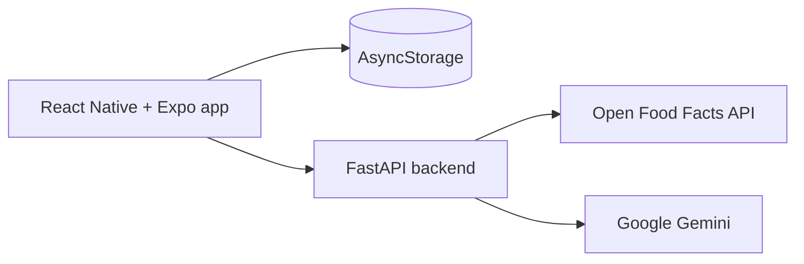

# Nutri Ninja 5.0

An AI-powered food scanner Android app. Scan any packaged food barcode, get instant health scores, ingredient warnings, personalized nutrition advice, and AI-powered diet chat — all stored locally on your phone.

---

## Demo

[Watch the Nutri Ninja demo video](https://lnkd.in/p/d9QA53uW)

**Status:** MVP complete | Android APK build configured | Backend deployed

**Try it:** Build the installable Android APK with the [`preview` EAS profile](frontend/eas.json#L8-L16). The build steps are documented in [Frontend — Android APK Build](#frontend--android-apk-build).

## Screenshots

<p align="center">
  
  
  
  
  
</p>

---

## Features

| Feature | Description |
|---|---|
| Barcode Scanner | Scan packaged food barcodes with the phone camera |
| Product Search | Search millions of products by name or brand |
| Health Score | Custom 1–100 score based on sugar, fat, salt, fiber, protein |
| Nutri-Score | Official A–E grade display |
| Nutrition Warnings | Flags high sugar, salt, saturated fat automatically |
| Personalized Insights | Advice tailored to your goal (diabetes, weight loss, muscle gain, heart health) |
| Grocery Basket | Add products, see basket-level health grade and AI analysis |
| Scan History | Browse previously scanned products |
| AI Diet Chat | Gemini-powered nutrition assistant (per product and general) |
| Food Label OCR | Paste label text → AI analyzes ingredients |
| Multi-Profile | Manage diet profiles for each family member |
| Dark / Day Mode | Toggle from the profile or basket screen |
| Local Storage | All data saved on the device — no account required |

---

## Technical Highlights

- Built an offline-first mobile experience with per-profile scan history and grocery baskets stored in AsyncStorage.
- Designed a custom 1–100 health-score algorithm combining sugar, fat, salt, fiber, and protein values.
- Integrated Open Food Facts for product data and Gemini for personalized nutrition analysis, recommendations, and chat.
- Added barcode scanning, ingredient-label analysis, diet profiles, accessibility-friendly themes, and voice-ready chat flows.
- Deployed a FastAPI backend on Render with separate endpoints for products, analysis, chat, recommendations, and label analysis.

## Architecture



---

## Tech Stack

| Layer | Technology |
|---|---|
| Mobile App | React Native 0.85, Expo SDK 56, Expo Router |
| Language | TypeScript |
| Backend | FastAPI (Python), deployed on Render.com |
| AI | Google Gemini 1.5 Flash |
| Product Data | Open Food Facts API |
| Local Storage | AsyncStorage (`@react-native-async-storage/async-storage`) |
| HTTP Client | Axios |
| Camera | expo-camera |
| Build | EAS Build (Expo Application Services) |

---

## Project Structure

```
Nutri Ninja 5.0/
├── backend/
│   ├── app/
│   │   └── main.py          # FastAPI app — all endpoints
│   ├── requirements.txt     # Python dependencies (UTF-8)
│   ├── render.yaml          # Render.com deployment config
│   └── .env                 # Local secrets (never commit)
├── frontend/
│   ├── src/
│   │   ├── app/             # Expo Router screens (tabs)
│   │   │   ├── _layout.tsx      # Root layout, store hydration
│   │   │   ├── index.tsx        # Scan tab
│   │   │   ├── history.tsx      # Ninja Hub tab
│   │   │   ├── grocery-basket.tsx
│   │   │   ├── explore.tsx      # AI Assistant tab
│   │   │   └── profile.tsx      # Diet Profile tab
│   │   ├── screens/
│   │   │   ├── ScannerScreen.tsx
│   │   │   └── ProductDetailScreen.tsx
│   │   ├── components/
│   │   │   ├── diet-advisor-chat.tsx
│   │   │   ├── ocr-label-reader.tsx
│   │   │   └── product-image.tsx
│   │   ├── services/
│   │   │   └── api.ts           # Backend + OpenFoodFacts client
│   │   └── utils/
│   │       ├── localStore.ts    # AsyncStorage persistence
│   │       ├── healthScore.ts
│   │       ├── recommendations.ts
│   │       └── themeMode.tsx
│   ├── app.json             # Expo config, Android permissions
│   ├── eas.json             # EAS build config
│   └── package.json
└── README.md
```

---

## Backend — Local Development

```bash
cd backend
venv\Scripts\activate          # Windows
pip install -r requirements.txt
uvicorn app.main:app --reload --host 0.0.0.0 --port 8000
```

Backend runs at `http://localhost:8000`

Swagger docs at `http://localhost:8000/docs`

### Environment Variables (`backend/.env`)

```env
GEMINI_API_KEY=AIza...          # From https://aistudio.google.com/apikey
GEMINI_MODEL=gemini-1.5-flash   # Default model
```

---

## Backend — Production (Render.com)

Deployed at: `https://nutri-ninja-5-0.onrender.com`

> Note: The Render free tier sleeps after inactivity. The first request after sleep can take around 30 seconds; later requests are faster.

| Endpoint | Method | Description |
|---|---|---|
| `/` | GET | Health check |
| `/product/{barcode}` | GET | Fetch product from Open Food Facts |
| `/search?query=` | GET | Search products |
| `/analyze` | POST | Analyze product with user profile |
| `/chat` | POST | Gemini AI nutrition chat |
| `/chat/voice` | POST | Voice message to Gemini |
| `/recommendations` | POST | Better/worse product suggestions |
| `/label/analyze` | POST | Analyze pasted ingredient text |

### Redeploy on Render

1. Push to GitHub → Render auto-redeploys
2. Or: Render dashboard → Manual Deploy

---

## Frontend — Android APK Build

### Prerequisites
- Node.js 18+
- EAS CLI: `npm install -g eas-cli`
- Expo account at expo.dev

### Build APK

```cmd
# Windows — run in Command Prompt
set NODE_TLS_REJECT_UNAUTHORIZED=0
cd frontend
eas login
eas build -p android --profile preview
```

Download the `.apk` from the link EAS provides and install it on Android. An APK release URL is not committed to this repository yet.

### Build Config (`frontend/eas.json`)

```json
{
  "build": {
    "preview": {
      "android": { "buildType": "apk" },
      "env": {
        "EXPO_PUBLIC_BACKEND_URL": "https://nutri-ninja-5-0.onrender.com"
      }
    }
  }
}
```

---

## Frontend — Local Development

```bash
cd frontend
npm install
npx expo start
```

Press `a` to open on Android emulator, or scan the QR code with Expo Go.

Set `EXPO_PUBLIC_BACKEND_URL` in `frontend/.env` to your local backend IP:

```env
EXPO_PUBLIC_BACKEND_URL=http://192.168.X.X:8000
```

---

## Data Storage

All user data is stored **locally on the device** using AsyncStorage:

| Key | Data |
|---|---|
| `familyProfiles` | Array of diet profiles |
| `activeProfileId` | Currently active profile |
| `scanHistory:{profileId}` | Per-profile scan history (max 30) |
| `groceryBasket:{profileId}` | Per-profile basket (max 30) |
| `themeModeV2` | `"dark"` or `"day"` |

Data persists across app restarts. No account or internet needed for local features.

---

## Android Permissions

| Permission | Reason |
|---|---|
| `CAMERA` | Barcode scanning |
| `INTERNET` | Product lookup and AI chat |

---

## Known Limitations

- **OCR image capture** — Tesseract.js is web-only. On Android, paste label text manually into the OCR screen.
- **Voice chat** — Web Speech API is browser-only. Mic button is disabled on Android; use text chat instead.
- **Render free tier** — Backend sleeps after 15 min of inactivity. First request after sleep may take ~30 sec. Subsequent requests are fast.
- **Gemini free tier** — Limited to 15 requests/minute. If busy, retry after ~30 seconds.
